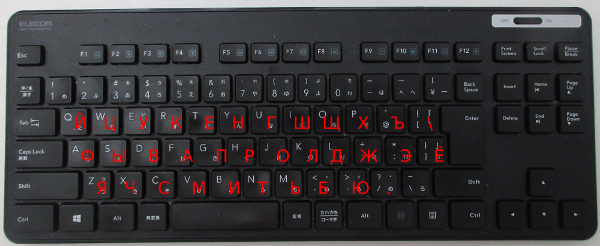

# ibus-russian-elecom

Russian [ibus](https://github.com/ibus/ibus) layout for using a Japanese Elecom keyboard

I type in English, Russian and Japanese, all using a Japanese keyboard.
These are mostly like a regular US QWERTY keyboard, but with some exceptions, e.g. extra keys and non-letter characters in odd locations.

The existing ibus layouts for Russian don't seem to work well with this keyboard, so I made my own using instructions from [here](http://www.studymongolian.net/technical/how-to-create-linux-input-method-editor/).

## The layout



## Install instructions

```
git clone git@github.com:mpenkov/ibus-russian-elecom.git
sudo ibus-table-createdb -n /usr/share/ibus-table/tables/russian-elecom.db -s ibus-russian-elecom/russian-elecom.txt
ibus-daemon -drx
ibus-setup
```

The last command will open the ibus configuration utility.
Go to the "Input method" tab, click on "Add", then "Russian", and "Russian - Russian (Elecom)" should show up.

## Avoiding undesired LShift behavior

Some versions of ibus use the left shift key to toggle between direct and table input mode.
This may be convenient for some languages (e.g. Chinese) but it's most inconvenient if you use the shift key to temporary shift case.
Moreover, it's impossible to disable this behavior through the configuration utility, unless you're running ibus-table version 1.12.0 and onwards.
I don't have access to that version yet, so I patched my local ibus to disable the behavior conditionally.
To apply the patch:

```
sudo patch -b -p1 /usr/share/ibus-table/engine/table.py < patch.txt
ibus-daemon -drx
```

I made the patch from the version packaged in the ibus-table Ubuntu package 1.9.25-1, but it should work equally well for other versions.
